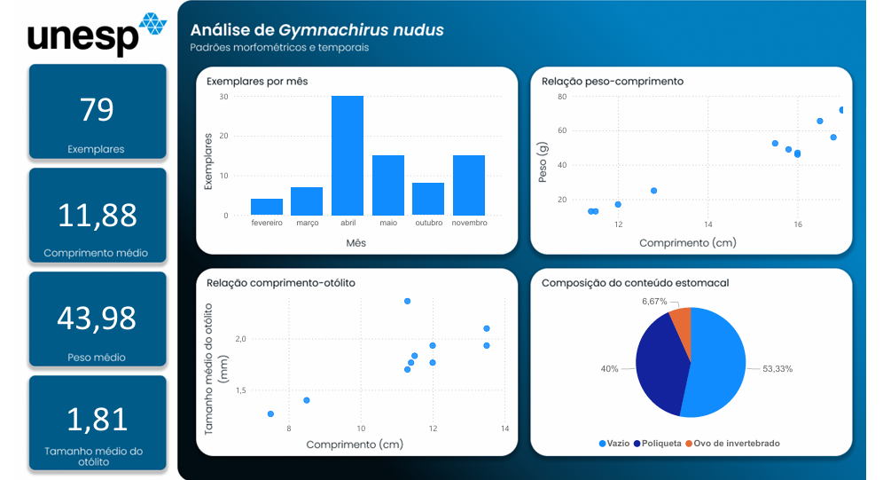

# 📊 Análise de Dados Biométricos de Peixes

Este projeto consiste em uma análise exploratória de dados biométricos de peixes, desenvolvida a partir de uma base de dados real coletada durante meu período de iniciação científica em biologia marinha na UNESP (São Vicente).

O objeto de estudo é o **linguado-zebra**, espécie comum no litoral paulista, conhecida cientificamente como _Gymnachirus nudus_. Durante a pesquisa, fui responsável pela coleta de dados morfológicos e biológicos dos exemplares, como comprimento, peso, informações alimentares e medidas do otólito.

  
> O **otólito** é uma estrutura calcificada presente no ouvido interno dos peixes. Ele auxilia na audição e no equilíbrio e, por isso, seu tamanho costuma ter relação direta com o crescimento do animal, sendo amplamente utilizado em estudos morfológicos e populacionais.

Um tempo depois da coleta, decidi revisitar essa base de dados e aprimorar as análises aplicando conhecimentos em **análise de dados**, **tratamento de dados** e **visualização**, utilizando Google Sheets e Power BI.

---

## 🎯 Objetivo
Explorar relações entre **peso**, **comprimento** e **otólitos**, além de identificar **padrões sazonais** na quantidade de exemplares coletados ao longo do ano.

---

## 📁 Dados analisados
- Comprimento total
- Peso
- Comprimento, altura e largura dos otólitos
- Período de coleta (mês/época do ano)
- Conteúdo estomacal

Total de exemplares analisados: **79**

---

## 📊 Análises realizadas
- Relação peso × comprimento
- Quantidade de peixes por época do ano
- Média de comprimento dos exemplares
- Relação entre o comprimento do peixe e o tamanho do otólito
- Visualizações interativas desenvolvidas no Power BI

---

## 🛠️ Ferramentas utilizadas
- **Google Sheets** — limpeza, organização e tratamento dos dados  
- **Power BI** — análise exploratória e construção de dashboard  
- **GitHub** — versionamento e organização do portfólio

---

## Dashboard

